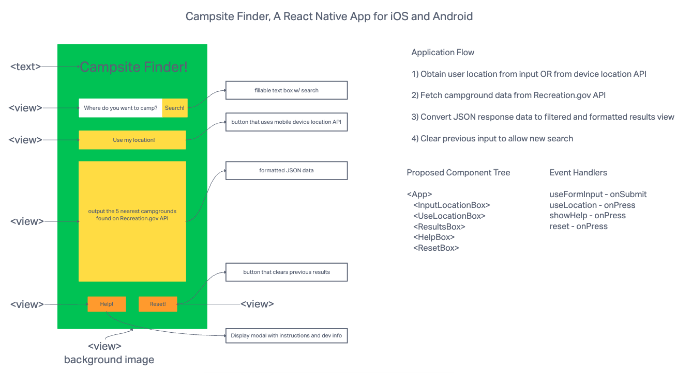

# About

Campsite Finder is an app that finds the nearest public campsite using remote API data from Active.com, and your current location obtained from the mobile device's built-in geolocation API.

Written in React Native using Expo for iOS and Android.

## Whiteboard

## User Stories

As a user, I want to search for public campgrounds at a particular location so I can plan an expedition

As a user, I want to able to find the public campgrounds closest to my physical location in case my expedition goes off course and I have to make an unexpected stop

## Todo Tasks (more to come)

// DONE  
Layout user interface in Expo  

// DONE  
Write event handlers  

// DONE  
Test Recreation.gov API (GET requests only) - DID NOT WORK  

// DONE
Find another campground API  
Active.com API worked  

// TODO  
Add reset button  

// TODO  
Create developer accounts for iOS / Android  

// TODO  
Publish to app stores  
